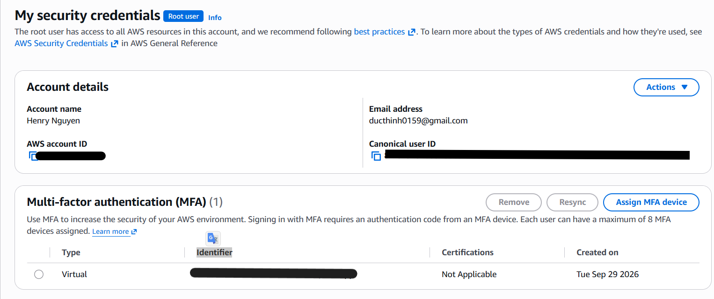
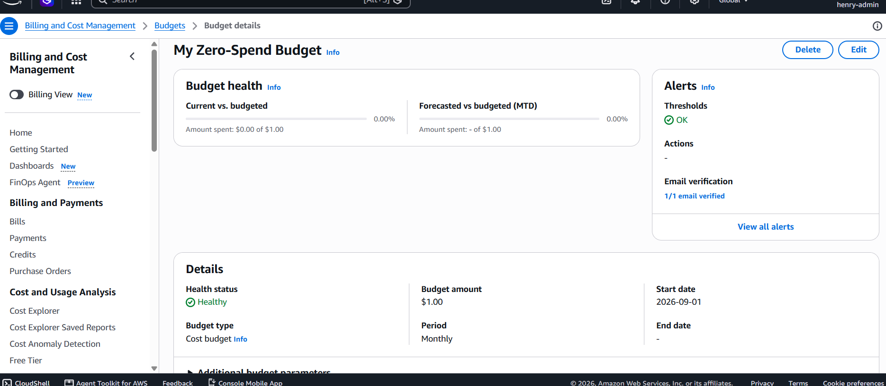

# Week 1 — Cloud Fundamentals & Account Setup

## Root vs IAM

The root user is the owner of an AWS account and has full access to everything in it, so it should only be used for tasks that require it, such as changing account or billing settings, closing the account, or recovering access.
For daily AWS work, we should use an IAM user instead of root.
An IAM user has its own credentials and can be given specific permissions through IAM policies.
For week 1, my `henry-admin` IAM user has administrative permissions so I can complete the training labs without using the root account every day.

## Shared Responsibility Model

The AWS Shared Responsibility Model means AWS is responsible for security *of* the cloud, such as physical data centers, hardware, and underlying infrastructure.
I am responsible for security *in* the cloud, including my credentials, IAM permissions, application settings, data, and security configurations.
Enabling MFA and avoiding daily use of the root account are examples of security responsibilities that belong to me as the AWS customer.

## Evidence

